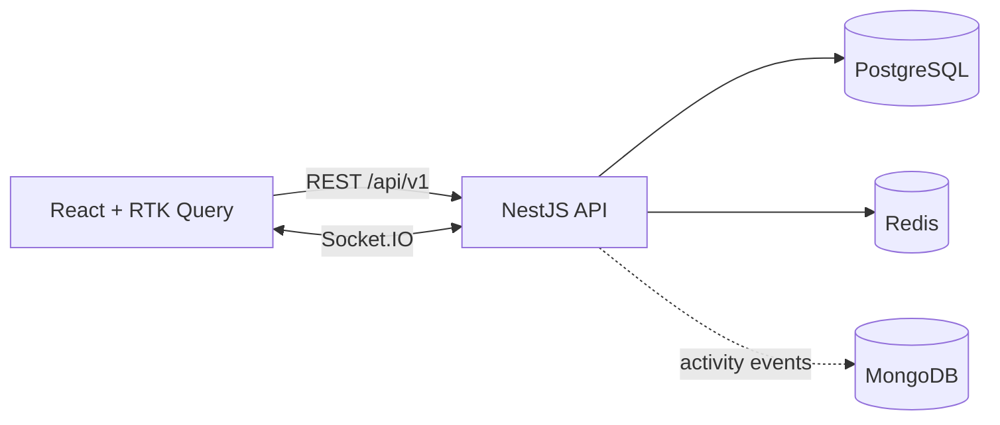

# Squad of Champions

Fullstack solution to the **360 VUZ Fullstack Challenge**. You build a squad of up to 6 fighting-game champions. Characters, filtering and squads are served by a **NestJS API** backed by **PostgreSQL** and **Redis**, and consumed by a **React + Redux Toolkit** frontend.

> 🚧 **Work in progress.** Sections marked _TODO_ get filled in as features land. See [IMPLEMENTATION_PLAN.md](IMPLEMENTATION_PLAN.md) for the roadmap.

---

## Contents

- [Quick start](#quick-start)
- [URLs](#urls)
- [Tech stack](#tech-stack)
- [Repository structure](#repository-structure)
- [Architecture](#architecture)
- [Database schema](#database-schema)
- [Caching strategy](#caching-strategy)
- [API overview](#api-overview)
- [Squad rules and concurrency](#squad-rules-and-concurrency)
- [Bonus features](#bonus-features)
- [Configuration](#configuration)
- [Development mode (Docker)](#development-mode-docker)
- [Local development (without Docker)](#local-development-without-docker)
- [Testing](#testing)
- [Assumptions](#assumptions)
- [Trade-offs](#trade-offs)
- [What I would improve with more time](#what-i-would-improve-with-more-time)

---

## Quick start

Requirements: **Docker** with **Docker Compose**. Node is not needed to run the project.

```bash
cp backend/.env.example backend/.env
docker compose up --build
```

This starts PostgreSQL, Redis and MongoDB, runs the database migrations, seeds the characters from the original JSON file (idempotent), and starts the API and the frontend.

_TODO: migrations, seed and the frontend service aren't wired in yet. Today this starts the databases and the API._

If a host port is already taken, override it, for example `POSTGRES_PORT=5433 docker compose up --build` (also `REDIS_PORT`, `MONGO_PORT`, `API_PORT`).

## URLs

| Service           | URL                                          |
| ----------------- | -------------------------------------------- |
| Frontend          | http://localhost:5173 _(TODO: confirm port)_ |
| API               | http://localhost:3000/api/v1                 |
| Swagger / OpenAPI | http://localhost:3000/api/docs               |
| Health check      | http://localhost:3000/api/v1/health          |

## Tech stack

| Layer                  | Choice                                                                  |
| ---------------------- | ----------------------------------------------------------------------- |
| API                    | NestJS 12, TypeScript 6 (strict), ESM                                   |
| Database               | PostgreSQL 17 with Drizzle ORM and drizzle-kit migrations               |
| Cache                  | Redis 7                                                                 |
| Real-time _(bonus)_    | Socket.IO gateway with the Redis adapter                                |
| Activity log _(bonus)_ | MongoDB 7                                                               |
| Frontend               | React, Redux Toolkit, RTK Query, TypeScript (FSD structure)             |
| Tooling                | Node 24 (`.nvmrc`), ESLint (typescript-eslint strict), Prettier, Vitest |

## Repository structure

```
squad-of-champions/
├─ backend/              # NestJS API
├─ frontend/             # React app (from the frontend challenge)
├─ docker/postgres/init/ # creates the e2e test database on first start
├─ docker-compose.yml    # postgres, redis, mongo, backend, frontend
├─ docker-compose.dev.yml # dev overrides: hot reload, debugger, pretty logs
├─ IMPLEMENTATION_PLAN.md
└─ README.md
```

## Architecture



_TODO: describe the module boundaries (auth, users, characters, squads, cache, health, realtime, activity) and the request flow._

## Database schema

_TODO: add the ER diagram and explain the reasoning once the characters JSON has been analysed._

## Caching strategy

_TODO: describe the key design, version-key invalidation driven by the seed, TTLs, and what is deliberately not cached._

## API overview

Full interactive docs are in Swagger at `/api/docs`. Every endpoint uses the `/api/v1` prefix.

| Method               | Endpoint                              | Auth |
| -------------------- | ------------------------------------- | ---- |
| POST                 | `/auth/register`                      | —    |
| POST                 | `/auth/login`                         | —    |
| GET                  | `/auth/me`                            | JWT  |
| GET                  | `/characters`                         | —    |
| GET                  | `/characters/filters`                 | —    |
| GET                  | `/characters/:id`                     | —    |
| GET / POST           | `/squads`                             | JWT  |
| GET / PATCH / DELETE | `/squads/:id`                         | JWT  |
| POST / DELETE        | `/squads/:id/characters/:characterId` | JWT  |
| GET                  | `/health`                             | —    |

Error response format:

```json
{
  "statusCode": 422,
  "error": "SQUAD_FULL",
  "message": "A squad cannot have more than 6 characters"
}
```

| Code                  | Status | When                                                                              |
| --------------------- | ------ | --------------------------------------------------------------------------------- |
| `VALIDATION_FAILED`   | 400    | Invalid or unknown fields; `details` lists each field's errors                    |
| `UNAUTHORIZED`        | 401    | Missing, malformed, forged or expired token, or the user no longer exists         |
| `INVALID_CREDENTIALS` | 401    | Wrong email or password (same response for both, so emails can't be probed)       |
| `EMAIL_TAKEN`         | 409    | Registering an email that exists, case-insensitively                              |
| `NOT_FOUND`           | 404    | Unknown route                                                                     |
| `SERVICE_UNAVAILABLE` | 503    | `/health` when Postgres or Redis is down; `details` has the per-dependency report |

_TODO: squad and character codes._

### Authentication

- `POST /auth/register` and `POST /auth/login` return `{ accessToken, tokenType: "Bearer", expiresIn, user }`. Registering logs the user in straight away.
- Send `Authorization: Bearer <accessToken>` on protected routes. Every route requires a token unless it is marked public (auth, characters, health).
- Passwords are hashed with **argon2id** (`@node-rs/argon2`, prebuilt binaries with no install scripts). Emails are trimmed and lowercased, and a unique index on `lower(email)` enforces uniqueness in the database, so two concurrent registrations can't both succeed.
- Login runs the hash check even when the email doesn't exist, so response times don't reveal which emails are registered.
- Tokens are HS256 JWTs, valid for `JWT_EXPIRES_IN_SECONDS`. There are no refresh tokens (out of scope).

## Squad rules and concurrency

The server enforces these rules:

- a squad has at most **6** characters
- no character appears twice in the same squad
- every character id must exist

_TODO: explain the row lock (`SELECT … FOR UPDATE`) and the DB constraints that back it up (`position` 1–6, unique `(squad, position)`, unique `(squad, character)`), and how the parallel-request test checks them._

## Bonus features

- [ ] WebSockets: squad sync across tabs and devices, live popularity, Redis adapter
- [ ] MongoDB: squad activity log with history and pick-statistics endpoints

_TODO: explain why the activity log fits a document store._

## Configuration

All settings come from environment variables. See [`backend/.env.example`](backend/.env.example) for the full list with comments. The repository contains no secrets.

## Development mode (Docker)

`docker-compose.dev.yml` runs the backend with hot reload instead of the production image:

- Source is mounted from `./backend`, and `nest start --watch` reloads about 2 seconds after you save.
- `NODE_ENV=development`, so logs are pretty-printed.
- Migrations run on every start.
- The Node debugger listens on `localhost:9229` (override with `DEBUG_PORT`). Attach from VS Code or Chrome DevTools.
- The dev image is tagged `squad-of-champions-backend:dev`, so it never replaces the production image.

```bash
docker compose -f docker-compose.yml -f docker-compose.dev.yml up --build
```

To make dev mode the default on your machine, create a root `.env` (gitignored) with:

```bash
COMPOSE_FILE=docker-compose.yml:docker-compose.dev.yml
```

Plain `docker compose up` then starts dev mode, while a fresh clone still gets production. Inside the container, `node_modules` is kept separate from your host's (Linux vs macOS binaries). After changing dependencies, rebuild and reset it:

```bash
docker compose up --build --renew-anon-volumes
```

## Local development (without Docker)

```bash
nvm use                       # Node 24.21.0
docker compose up -d --wait postgres redis mongo
cd backend
cp .env.example .env          # then switch the hosts to localhost
npm install
npm run start:dev             # pretty logs in development, JSON in production
```

Database scripts: `npm run db:generate` (drizzle-kit migration from the schema), `npm run db:migrate` (apply migrations; the Docker entrypoint runs this on every start) and `npm run db:studio`.

_TODO: add the migrate and seed commands, and the frontend steps._

## Testing

```bash
cd backend
npm run lint          # ESLint
npm run format:check  # Prettier
npm run typecheck     # tsc --noEmit
npm test              # unit tests (no infrastructure needed)

# e2e tests run against the compose databases, using a separate Postgres
# database (squad_of_champions_test) and Redis DB index 1, from backend/.env.test
docker compose up -d --wait postgres redis
npm run test:e2e
```

The test database is created automatically the first time the Postgres volume starts (`docker/postgres/init/`). If your volume predates that script, create it once:

```bash
docker compose exec postgres psql -U squad -d squad_of_champions -c "CREATE DATABASE squad_of_champions_test OWNER squad"
```

## Assumptions

Where the brief was ambiguous, I made a reasonable choice and recorded it here:

- A user can own **many squads**. The frontend has a squad switcher.
- _TODO: tag filter semantics, sort options, pagination type, error codes, squad name rules, stats for an empty squad._

## Trade-offs

_TODO_

## What I would improve with more time

_TODO_
