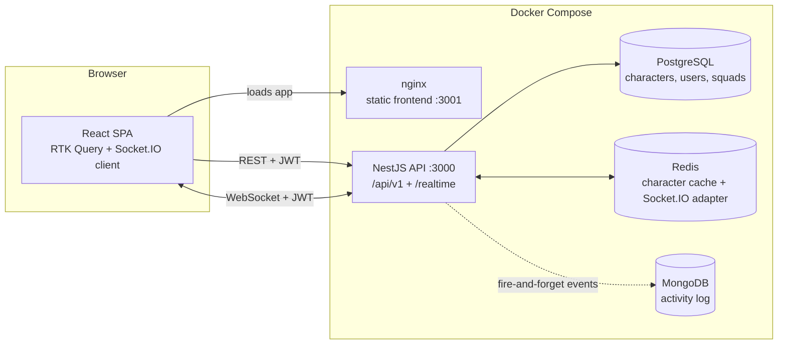
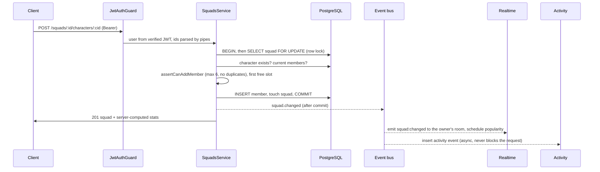
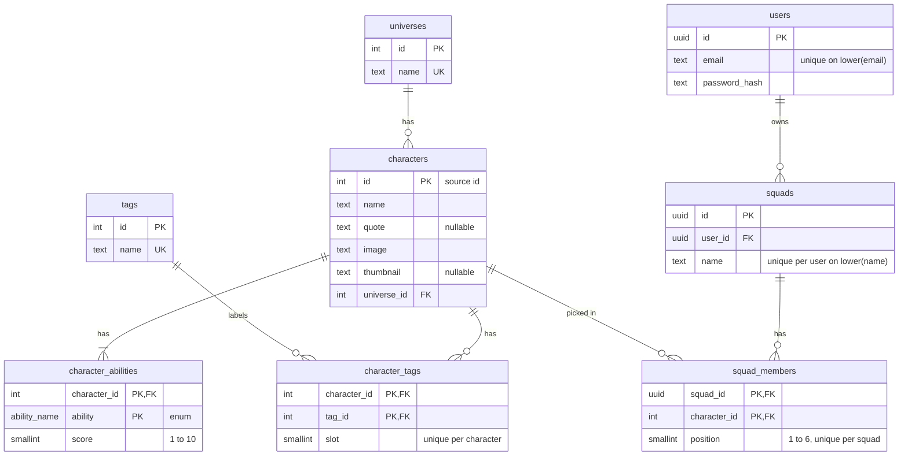

# Squad of Champions

Fullstack solution to the **360 VUZ Fullstack Challenge**.

---

## Contents

- [Quick start](#quick-start)
- [URLs](#urls)
- [Tech stack](#tech-stack)
- [Repository structure](#repository-structure)
- [Architecture](#architecture)
- [Database schema](#database-schema)
- [Caching strategy](#caching-strategy)
- [API overview](#api-overview)
- [Frontend](#frontend)
- [Squad rules and concurrency](#squad-rules-and-concurrency)
- [Bonus features](#bonus-features)
- [Configuration](#configuration)
- [Development mode (Docker)](#development-mode-docker)
- [Local development (without Docker)](#local-development-without-docker)
- [Testing](#testing)
- [Assumptions](#assumptions)
- [Trade-offs](#trade-offs)
- [What I would improve with more time](#what-i-would-improve-with-more-time)

---

## Quick start

Requirements: **Docker** with **Docker Compose**. Node is not needed to run the project.

```bash
cp backend/.env.example backend/.env
docker compose up --build
```

This starts PostgreSQL, Redis and MongoDB, runs the database migrations, seeds the characters from the original JSON file (idempotent), and starts the API and the frontend.

Then open **http://localhost:3001**, create an account, and start picking champions.

This was verified on a fresh clone with fresh volumes: all five services become healthy, and the migrations, seed, API, WebSockets and frontend work end to end. The first build takes a few minutes to download images and install dependencies; with images cached, startup takes about 20 seconds.

If a host port is already taken, override it, for example `POSTGRES_PORT=5433 docker compose up --build` (also `REDIS_PORT`, `MONGO_PORT`, `API_PORT`, `FRONTEND_PORT`). If the API is served from another address, rebuild the frontend with `PUBLIC_API_URL=https://… docker compose up --build`.

## URLs

| Service           | URL                                 |
| ----------------- | ----------------------------------- |
| Frontend          | http://localhost:3001               |
| API               | http://localhost:3000/api/v1        |
| Swagger / OpenAPI | http://localhost:3000/api/docs      |
| Health check      | http://localhost:3000/api/v1/health |

## Tech stack

| Layer                  | Choice                                                                                             |
| ---------------------- | -------------------------------------------------------------------------------------------------- |
| API                    | NestJS 12, TypeScript 6 (strict), ESM                                                              |
| Database               | PostgreSQL 17 with Drizzle ORM and drizzle-kit migrations                                          |
| Cache                  | Redis 7                                                                                            |
| Real-time _(bonus)_    | Socket.IO gateway with the Redis adapter                                                           |
| Activity log _(bonus)_ | MongoDB 7                                                                                          |
| Frontend               | React 18 (Create React App), Redux Toolkit, RTK Query, MUI 5, TypeScript 5.9 (FSD structure)       |
| Tooling                | Node 24 (`.nvmrc`), ESLint (typescript-eslint strict), Prettier, Vitest (backend), Jest (frontend) |

## Repository structure

```
squad-of-champions/
├─ backend/              # NestJS API
├─ frontend/             # React app (from the frontend challenge)
├─ docker/postgres/init/ # creates the e2e test database on first start
├─ docker-compose.yml    # postgres, redis, mongo, backend, frontend
├─ docker-compose.dev.yml # dev overrides: hot reload, debugger, pretty logs
└─ README.md
```

## Architecture



### Backend modules

| Module               | Responsibility                                                                                                                                              | Talks to                 |
| -------------------- | ----------------------------------------------------------------------------------------------------------------------------------------------------------- | ------------------------ |
| `config`             | Reads env vars through a zod schema, fails at boot on bad config, exposes typed config                                                                      | —                        |
| `common`             | Error filter (`{ statusCode, error, message, details? }`), validation pipe errors, error codes, `@Public()`, `@CurrentUser()`, transformers, cursor helpers | —                        |
| `database`           | Drizzle connection, schema, migrations, idempotent seed                                                                                                     | PostgreSQL               |
| `integrations/redis` | Redis client, version-key `CacheService`, Socket.IO Redis adapter                                                                                           | Redis                    |
| `integrations/mongo` | MongoDB client (connects on first use, fails fast)                                                                                                          | MongoDB                  |
| `auth`               | Register, login, `me`, global JWT guard, `verifyAccessToken` (shared with WebSockets)                                                                       | `users`                  |
| `users`              | User lookup and creation (email uniqueness)                                                                                                                 | PostgreSQL               |
| `characters`         | Search, filters, keyset pagination, filter values, batch lookups                                                                                            | PostgreSQL, Redis        |
| `squads`             | CRUD, add/remove members, rules and stats (pure `domain/` functions), row locks, publishes `squad.changed`                                                  | PostgreSQL, `characters` |
| `realtime`           | Socket.IO gateway: squad sync to the owner's sessions, debounced live popularity                                                                            | `auth`, Redis adapter    |
| `activity`           | Records `squad.changed` events in MongoDB; history timeline and pick statistics                                                                             | MongoDB, `characters`    |
| `health`             | Postgres and Redis (required), MongoDB (reported as degraded only)                                                                                          | all stores               |

Modules depend on each other only through exported services, and **squads never calls realtime or activity directly**: it publishes a domain event after each commit, and those modules subscribe. Adding another consumer, such as notifications, wouldn't touch squad code.

### Request flow: adding a character to a squad



A character list request takes the read path: public route → `ValidationPipe` (normalizes filters) → `CharactersService` → `CacheService` (`HIT` returns immediately) → repository (4 queries on a miss) → mapper → `X-Cache` header.

**Cross-cutting:**

- Every request gets an `x-request-id` (reused from the incoming header, otherwise generated), logged by `nestjs-pino` as JSON in production and pretty-printed in development.
- Helmet sets security headers, CORS only allows `FRONTEND_URL`, and graceful shutdown closes the Postgres, Redis and Mongo connections.

## Database schema



**Why it looks like this** (from profiling all 208 characters in `characters.json`):

- **The source `id` is the primary key.** Ids are unique integers 1–208, so the seed upserts on them and can run any number of times without duplicates. Squads reference these same ids.
- **`universes` and `tags` are lookup tables.** There are 4 universes and 21 tags, repeated across hundreds of rows. Filters join on small integer keys, and `GET /characters/filters` reads the lists straight from these tables.
- **`character_tags` keeps the tag `slot`** (1–3) so tags come back in the original order. The primary key `(character_id, tag_id)` prevents duplicates, and `(tag_id, character_id)` is indexed for filtering by tag.
- **Abilities are rows, not columns.** Every character has the same 5 abilities scored 1–10, stored as `character_abilities(character_id, ability, score)` with a Postgres enum for the names and a check constraint on the range. Squad stats become a single `AVG(score) ... GROUP BY ability`, and a new ability would need no schema change.
- **Data quirks are kept, not fixed.** RoboCop has no `quote`, Skarlet has no `tags` and Android 21 (Lab Coat) has no `thumbnail`, so those columns allow empty values and Skarlet has zero tag rows. The API falls back to `image` when `thumbnail` is missing. The `grappling` tag (used once, beside 24 uses of `grapple`) is kept exactly as in the source.
- **Indexes:** a trigram GIN index on `lower(name)` for `ILIKE '%term%'` search, `(name, id)` for sorting and keyset pagination by name, and `universe_id`. With 208 rows Postgres correctly prefers a full scan (0.06 ms measured with `EXPLAIN ANALYZE`). With the btree index hidden, it does use the trigram index, so search stays fast as data grows.

**Seeding:** `src/database/seed.ts` validates the JSON's shape with zod, then upserts universes, tags and characters and rebuilds their tag and ability rows in one transaction. Docker mounts `frontend/src/data` read-only at `/data`, so the original file is the single source of truth and cannot be modified. The entrypoint runs migrate, then seed, on every start.

## Caching strategy

Character reads are cached in Redis. Squads are per-user and change often, so they are not cached.

| What          | Key                                          |
| ------------- | -------------------------------------------- |
| A list page   | `cache:characters:v{version}:list:{hash}`    |
| One character | `cache:characters:v{version}:character:{id}` |
| Filter values | `cache:characters:v{version}:filters`        |

- **Identical requests share a key.** The hash covers the filters, sort, order, page size and cursor position after normalizing them: values are trimmed, de-duplicated and sorted, and defaults are filled in. So `tags=ninja,human` and `tags=human, ninja` hit the same entry.
- **Invalidation is a version bump.** Every key embeds `cache:characters:version`, and the seed runs `INCR` on it after writing, so old entries stop being read immediately and expire through their TTL (`CACHE_TTL_SECONDS`, default 1 hour). This avoids scanning or deleting keys.
- **Concurrent misses load once.** If several requests miss the same key at the same moment, one database load serves them all.
- **Redis outages degrade, they don't fail.** If Redis is unreachable, requests read straight from Postgres.
- **Every characters response says what happened** in an `X-Cache` header: `HIT`, `MISS`, or `BYPASS` when Redis is down.

**Measured** (dev mode, 50 items, median of 11 requests): 6.7 ms on a miss, 2.4 ms on a hit. With statement logging enabled, an uncached list page ran exactly **4 SQL queries whatever its size** (page, total, tags, abilities), a single character 3 and the filter values 2, so there are no N+1 queries.

## API overview

Full interactive docs are in Swagger at `/api/docs`. Every endpoint uses the `/api/v1` prefix.

| Method               | Endpoint                              | Auth |
| -------------------- | ------------------------------------- | ---- |
| POST                 | `/auth/register`                      | —    |
| POST                 | `/auth/login`                         | —    |
| GET                  | `/auth/me`                            | JWT  |
| GET                  | `/characters`                         | —    |
| GET                  | `/characters/filters`                 | —    |
| GET                  | `/characters/:id`                     | —    |
| GET / POST           | `/squads`                             | JWT  |
| GET / PATCH / DELETE | `/squads/:id`                         | JWT  |
| POST / DELETE        | `/squads/:id/characters/:characterId` | JWT  |
| GET                  | `/squads/:id/history`                 | JWT  |
| GET                  | `/activity/stats/picks`               | JWT  |
| GET                  | `/health`                             | —    |

Real-time updates use Socket.IO at `ws://localhost:3000/realtime` (see [WebSockets](#websockets)).

### Characters

`GET /characters` query parameters (all optional):

| Param           | Meaning                                                                                 |
| --------------- | --------------------------------------------------------------------------------------- |
| `search`        | Case-insensitive substring of the name. `%`, `_` and `\` match literally                |
| `tags`          | Tag names, comma-separated (`tags=alien,strong`) or repeated (`tags=alien&tags=strong`) |
| `tagMatch`      | `any` (default): a character has at least one of the tags. `all`: it has every one      |
| `universe`      | Universe names, comma-separated or repeated                                             |
| `sort`, `order` | `name` (default) or `id`; `asc` (default) or `desc`                                     |
| `limit`         | 1–50, default 20                                                                        |
| `cursor`        | The `nextCursor` from the previous page                                                 |

Different filters combine with AND. The response is `{ items, nextCursor, total }`, where `nextCursor` is `null` on the last page.

**Why cursor pagination:** the frontend loads more results as you scroll. A keyset cursor on `(name, id)` never skips or repeats a character when pages are fetched one after another, and it stays fast however deep you go, unlike `OFFSET`. The cursor is opaque and records its sort, so reusing it with a different sort returns `INVALID_CURSOR`. The trade-off is that you can't jump to page N; `total` lets the UI still show "44 results".

Each character is returned as `{ id, name, quote, image, thumbnail, universe, tags, abilities }`. `tags` is a list of names in their original slot order, and `abilities` is `[{ name, score }]` in a fixed order (Mobility, Technique, Survivability, Power, Energy).

`GET /characters/filters` returns `{ universes, tags, abilities, sortFields }`; universes and tags come as `{ name, count }`, so the frontend builds its filter UI from the data instead of hard-coding it.

Error response format:

```json
{
  "statusCode": 422,
  "error": "SQUAD_FULL",
  "message": "A squad cannot have more than 6 characters"
}
```

| Code                         | Status | When                                                                                  |
| ---------------------------- | ------ | ------------------------------------------------------------------------------------- |
| `VALIDATION_FAILED`          | 400    | Invalid or unknown fields; `details` lists each field's errors                        |
| `UNAUTHORIZED`               | 401    | Missing, malformed, forged or expired token, or the user no longer exists             |
| `INVALID_CREDENTIALS`        | 401    | Wrong email or password (same response for both, so emails can't be probed)           |
| `EMAIL_TAKEN`                | 409    | Registering an email that exists, case-insensitively                                  |
| `NOT_FOUND`                  | 404    | Unknown route                                                                         |
| `INVALID_CURSOR`             | 400    | Malformed cursor, or a cursor reused with a different sort or order                   |
| `INVALID_ID`                 | 400    | `GET /characters/:id` with a non-numeric id                                           |
| `CHARACTER_NOT_FOUND`        | 404    | No character with that id                                                             |
| `SQUAD_NOT_FOUND`            | 404    | No squad with that id for the current user                                            |
| `SQUAD_FULL`                 | 422    | More than 6 characters                                                                |
| `CHARACTER_ALREADY_IN_SQUAD` | 409    | A character twice in the same squad                                                   |
| `CHARACTER_NOT_IN_SQUAD`     | 404    | Removing a character that isn't in the squad                                          |
| `UNKNOWN_CHARACTERS`         | 422    | Character ids in a create/replace that don't exist; `details.characterIds` lists them |
| `SQUAD_NAME_TAKEN`           | 409    | The user already has a squad with that name, ignoring case                            |
| `SQUAD_LIMIT_REACHED`        | 422    | The user already has 20 squads                                                        |
| `SERVICE_UNAVAILABLE`        | 503    | `/health` when Postgres or Redis is down; `details` has the per-dependency report     |

### Authentication

- `POST /auth/register` and `POST /auth/login` return `{ accessToken, tokenType: "Bearer", expiresIn, user }`. Registering logs the user in straight away.
- Send `Authorization: Bearer <accessToken>` on protected routes. Every route requires a token unless it is marked public (auth, characters, health).
- Passwords are hashed with **argon2id** (`@node-rs/argon2`, prebuilt binaries with no install scripts). Emails are trimmed and lowercased, and a unique index on `lower(email)` enforces uniqueness in the database, so two concurrent registrations can't both succeed.
- Login runs the hash check even when the email doesn't exist, so response times don't reveal which emails are registered.
- Tokens are HS256 JWTs, valid for `JWT_EXPIRES_IN_SECONDS`. There are no refresh tokens (out of scope).

## Frontend

The challenge's Create React App is kept, as the brief provides it, and refactored to **Feature-Sliced Design**. The characters JSON is no longer imported anywhere in the UI; everything comes from the API.

```
src/
├─ app/       store, router (protected and guest routes), providers
├─ pages/     squad-builder, login, register
├─ widgets/   header, squad-overview, live-popularity, character-filters-panel, characters-table
├─ features/  auth, character-filters, toggle-squad-member, squad-switcher, squad-history, realtime-sync
├─ entities/  session, character, squad (RTK Query endpoints, slices, small UI)
└─ shared/    base API, config, theme, helpers, notifications
```

- **Data:** Redux Toolkit with **RTK Query**. Characters use an infinite query driven by the API's `nextCursor`. More rows load as you scroll, and the trigger checks where the sentinel really is after every page, so a fast scroll can't stall it. Search is debounced by 300 ms, and tag filters run on the server.
- **Squads through the API:**
  - Checking a row, or clicking an avatar's "Remove" overlay, updates the squad **optimistically**. The server's response then replaces it, bringing server-computed stats.
  - If the server refuses (for example `SQUAD_FULL`), the change is **rolled back** and the server's message appears in a snackbar.
  - A user can have several squads, managed from the switcher in the header (new, rename, delete). A default "My Squad" is created on first login.
- **"My Team"** filters the table down to the active squad's members, and the search box and tags still apply. **"Clear all"** resets every filter.
- **States:** skeletons while loading, an empty state with "Clear all filters", an error state with "Retry", and server validation errors shown on the right form field.
- **Auth:** the JWT and user are kept in **localStorage**, so the session and the active squad survive a reload. Every request sends `Authorization: Bearer`, and any 401 logs out and returns to `/login`. Trade-off: a token in localStorage can be read by injected scripts (XSS). The safer option is an httpOnly refresh-token cookie with the access token kept in memory, which is listed under improvements. React escapes everything it renders, and no HTML is injected.
- **Design:** MUI themed with the provided palette (primary `#217AFF`, red `#FF0000` for scores of 10, background `#F5FDFF`, gray `#999999`, primary overlay `rgba(33, 122, 255, 0.6)` for "Remove"), Roboto, and the design's layout.
- **Docker:** the production image builds the app and serves it with nginx; unknown paths fall back to `index.html` and assets are cached for a year. In dev mode (`docker-compose.dev.yml`) it runs the CRA dev server with your source mounted.

## Squad rules and concurrency

Every rule is enforced on the server, whatever the client sends:

| Rule                                           | Error                                                                                                               |
| ---------------------------------------------- | ------------------------------------------------------------------------------------------------------------------- |
| At most **6** characters per squad             | `422 SQUAD_FULL`                                                                                                    |
| A character appears at most once per squad     | `409 CHARACTER_ALREADY_IN_SQUAD`                                                                                    |
| Every character id must exist                  | `422 UNKNOWN_CHARACTERS` (create/replace, with the missing ids in `details`) or `404 CHARACTER_NOT_FOUND` (add one) |
| Squad names are unique per user, ignoring case | `409 SQUAD_NAME_TAKEN`                                                                                              |
| At most 20 squads per user                     | `422 SQUAD_LIMIT_REACHED`                                                                                           |
| Users only see and change their own squads     | `404 SQUAD_NOT_FOUND` (same as a missing squad, so ids can't be probed)                                             |

The rules live in pure functions (`modules/squads/domain/squad.rules.ts`) with unit tests, and squad stats are computed by `domain/squad.stats.ts`: average, min and max per ability plus an overall average, rounded to 2 decimals, with `null` for an empty squad.

**Concurrency: two layers.**

1. **Row locks in the app.** Every member change runs in one transaction that first locks the squad row (`SELECT … FOR UPDATE`), then reads the members, checks the rules and writes. Two requests for the same squad therefore run one after the other, and the second one sees the first one's result. Creating and renaming squads lock the user's row the same way, so the name check and the 20-squad limit can't race either.
2. **Constraints in the database.** `squad_members` has a check that `position` is between 1 and 6, a unique `(squad_id, position)` and a primary key `(squad_id, character_id)`. Even if the app logic had a bug, Postgres could not store a 7th member or a duplicate. These are a safety net: if one ever fired it would surface as a 500, because it would mean a bug.

New members take the first free slot (1–6), so removing a character leaves a gap that the next add fills. `PATCH` with `characterIds` replaces all members in the given order.

**Tested against real Postgres:** 10 parallel adds to a squad with 5 members give exactly one `201` and nine `SQUAD_FULL`. 10 parallel adds to an empty squad give exactly 6 members in slots 1–6. 5 parallel adds of the same character give one `201` and four `409`s. Two parallel creates with the same name give one `201` and one `409`.

## Bonus features

- [x] **WebSockets:** squad sync across tabs and devices, live popularity, Redis adapter
- [x] **MongoDB:** squad activity log with a history timeline and pick statistics built with an aggregation pipeline

### WebSockets

A Socket.IO gateway at namespace **`/realtime`** on the API host (`ws://localhost:3000/realtime`).

**Authentication:** the client sends the same JWT as the REST API, either in the handshake (`io(url, { auth: { token } })`) or as an `Authorization: Bearer` header. A connection middleware verifies it with the same `AuthService.verifyAccessToken` the HTTP guard uses. Invalid or missing tokens are refused before the connection opens, with `connect_error` carrying `{ error: "UNAUTHORIZED" }`.

| Event (server → client) | Sent to                                                                         | Payload                                                                                                                    |
| ----------------------- | ------------------------------------------------------------------------------- | -------------------------------------------------------------------------------------------------------------------------- |
| `squad:changed`         | Every open session of the squad's owner (room `user:{id}`)                      | `{ squadId, reason, characterId? }`, where `reason` is `created`, `updated`, `deleted`, `member-added` or `member-removed` |
| `popularity:updated`    | The new socket on connect, then everyone after squad changes (debounced 500 ms) | `{ characters: [{ characterId, name, thumbnail, picks }], updatedAt }`, the top 10 by number of squads                     |

**How it's wired:**

- `SquadsService` publishes a `squad.changed` domain event (`@nestjs/event-emitter`) after each successful change. Events fire only after the transaction commits, so a rolled-back change is never announced.
- The realtime module listens for those events. The squads code never touches sockets, and the activity-log bonus can subscribe to the same events.
- **Several API instances:** the gateway uses `@socket.io/redis-adapter`, so an emit on one instance reaches clients connected to any instance. The e2e tests prove this with two app instances: a change made through instance 1 reaches a socket connected to instance 2. Channel names are prefixed with `NODE_ENV`, so tests and the dev stack sharing one Redis never see each other's events.
- **Frontend:** `features/realtime-sync` opens the socket while logged in and closes it on logout.
  - `squad:changed` invalidates the RTK Query cache for that squad and the squad list, so other tabs refetch and update without a reload.
  - `popularity:updated` feeds the "Most picked right now" strip, which has a live/reconnecting indicator.
  - Socket.IO reconnects automatically.

**Trade-offs:**

- `squad:changed` carries no squad data, so receivers refetch it over REST. That keeps one source of truth and its ownership checks, at the cost of one extra request per change.
- The tab that made the change also receives the event and refetches once. That's harmless, and simpler than tracking socket ids.
- Popularity is a `COUNT(*) … GROUP BY` over `squad_members` (indexed on `character_id`), recomputed at most twice a second per instance.
- A token that expires while connected keeps that socket open until it reconnects.

### MongoDB activity log

Every squad change is also written to MongoDB as an immutable event in the `activity_events` collection:

```json
{
  "_id": "6702…",
  "type": "member-added",
  "userId": "…",
  "squadId": "…",
  "squadName": "Saiyan Pride",
  "character": { "id": 37, "name": "Adult Gohan", "thumbnail": "https://…" },
  "occurredAt": "2026-10-05T17:57:00.000Z"
}
```

| Endpoint (JWT)                         | What it returns                                                                                                                                                                                                                                                                                    |
| -------------------------------------- | -------------------------------------------------------------------------------------------------------------------------------------------------------------------------------------------------------------------------------------------------------------------------------------------------- |
| `GET /squads/:id/history?limit&cursor` | The squad's timeline, newest first, with cursor paging. It still works after the squad is deleted, and returns an empty list for squads owned by someone else.                                                                                                                                     |
| `GET /activity/stats/picks?days=30`    | Pick statistics across all users, from **one aggregation pipeline**: `$match` on the time window → `$facet` with the top characters (`$group` by character with added/removed counts and last pick, `$addFields` net, `$sort`, `$limit`), a daily series (`$group` by `$dateToString`) and totals. |

The frontend shows the timeline under **squad menu → Squad history**.

**How it's wired:**

- It listens to the same `squad.changed` domain events as the WebSocket gateway, using an async listener.
- Writes are **fire-and-forget after the Postgres commit**. If MongoDB is down, squad changes still succeed and the failure is only logged. `/health` then reports Mongo as `degraded` but still returns 200, so the container stays healthy. Postgres and Redis remain hard requirements (503).
- Bulk changes are recorded per character. Creating a squad with members, or replacing members with `PATCH`, records one `member-added`/`member-removed` per character (computed by `domain/squad.diff.ts`), so the statistics count every pick.
- Events are stamped when they're published, and their ObjectId is assigned before any async work, so the timeline order is deterministic even for several events in the same millisecond.
- Indexes: `{ squadId, userId, occurredAt, _id }` for the timeline, `{ type, occurredAt }` for the stats `$match`, and `{ userId, occurredAt }` for a future "my activity" feed.

**Why a document store fits this data:**

- **Append-only and immutable.** Events are written once and never updated or joined against, so relational guarantees (foreign keys, transactions across tables) bring no benefit here. The log also deliberately outlives the rows it describes: deleted squads keep their history.
- **Snapshots, not references.** Each event embeds the squad and character name _as they were_, so a timeline reads correctly after renames and deletions. In Postgres that means duplicating columns or adding a JSON column anyway; in a document it's the natural shape.
- **Shape varies by event type.** Member events carry a character and squad events don't. More types (renames with the previous name, imports, …) can be added without migrations.
- **Analytics are its home turf.** `$facet` computes the top list, the daily series and the totals in a single pass, and the collection can grow or expire (TTL index) without affecting the transactional database.
- **Counterpoint:** Postgres could do all of this with an `activity_events` table and a `jsonb` payload, with one less service to run. For a log this size that would be perfectly fine. Mongo pays off as write volume and ad-hoc analytics grow, and it keeps analytics load off the database that enforces the squad rules.

## Configuration

All settings come from environment variables. See [`backend/.env.example`](backend/.env.example) for the full list with comments. The repository contains no secrets.

## Development mode (Docker)

`docker-compose.dev.yml` runs both apps with hot reload instead of the production images:

- Source is mounted from `./backend`, and `nest start --watch` reloads about 2 seconds after you save.
- `NODE_ENV=development`, so logs are pretty-printed.
- Migrations run on every start.
- The Node debugger listens on `localhost:9229` (override with `DEBUG_PORT`). Attach from VS Code or Chrome DevTools.
- The frontend runs the CRA dev server on the same port (3001), with your `./frontend` source mounted.
- The dev images are tagged `:dev`, so they never replace the production images.

```bash
docker compose -f docker-compose.yml -f docker-compose.dev.yml up --build
```

To make dev mode the default on your machine, create a root `.env` (gitignored) with:

```bash
COMPOSE_FILE=docker-compose.yml:docker-compose.dev.yml
```

Plain `docker compose up` then starts dev mode, while a fresh clone still gets production. Inside the container, `node_modules` is kept separate from your host's (Linux vs macOS binaries). After changing dependencies, rebuild and reset it:

```bash
docker compose up --build --renew-anon-volumes
```

## Local development (without Docker)

```bash
nvm use                       # Node 24.21.0
docker compose up -d --wait postgres redis mongo
cd backend
cp .env.example .env          # then switch the hosts to localhost
npm install
npm run start:dev             # pretty logs in development, JSON in production
```

Database scripts: `npm run db:generate` (drizzle-kit migration from the schema), `npm run db:migrate` and `npm run db:seed` (the Docker entrypoint runs both on every start), and `npm run db:studio`.

Frontend, in a second terminal:

```bash
cd frontend
npm install
npm start                     # http://localhost:3001, API URL from frontend/.env
```

## Testing

```bash
cd backend
npm run lint          # ESLint
npm run format:check  # Prettier
npm run typecheck     # tsc --noEmit
npm test              # unit tests (no infrastructure needed)

# e2e tests run against the compose services, using a separate Postgres
# database (squad_of_champions_test), Redis DB index 1 and a separate Mongo
# database, all from backend/.env.test
docker compose up -d --wait postgres redis mongo
npm run test:e2e
```

The test database is created automatically the first time the Postgres volume starts (`docker/postgres/init/`). If your volume predates that script, create it once:

```bash
docker compose exec postgres psql -U squad -d squad_of_champions -c "CREATE DATABASE squad_of_champions_test OWNER squad"
```

**What's covered:**

- **Backend:** 31 unit tests for the business logic: squad rules, stats, the member diff, auth, and the email race. 109 e2e tests against real Postgres, Redis and Mongo:
  - pagination over every sort, and filters compared against `characters.json` itself
  - caching: hit, miss, version bump and Redis down
  - auth and every error code
  - squad rules, including four concurrency races
  - the WebSocket gateway across two API instances
  - activity history and the aggregation pipeline, including Mongo being down
- **Frontend:** 14 unit tests for optimistic squad updates, formatting and activity descriptions.

Frontend:

```bash
cd frontend
npm run typecheck
npm run lint
npm run format:check
CI=true npm test      # unit tests (optimistic squad updates, formatting)
```

## Assumptions

Where the brief was ambiguous, I made a reasonable choice and recorded it here:

- A user can own **many squads**. The frontend has a squad switcher.
- Several tags match **any** of them by default (`tagMatch=all` requires every one). Different filters combine with AND.
- Filter values that don't exist return an empty page rather than an error.
- Characters can be sorted by `name` or `id`. Sorting by ability score is left out, because nothing in the brief asks for it.
- The `grappling` tag is kept exactly as in the source, even though it looks like a variant of `grapple`.
- Squad names are 1–50 characters after trimming and unique per user, ignoring case. A user can have up to 20 squads.
- `GET /squads` returns summaries (`id`, `name`, `memberCount`, timestamps), and `GET /squads/:id` the full squad with characters and stats. Every member change returns the updated squad, so the frontend never needs a second request.
- Stats for an empty squad are `null` rather than 0, so "no data" can't be mistaken for "scores of zero".

## Trade-offs

- **Create React App instead of Vite.** The challenge ships CRA and asks for a refactor, not a migration, so I kept it. It's slower and no longer maintained. TypeScript was upgraded to 5.9 through an npm `overrides` entry, because RTK Query's infinite queries need it.
- **JWT in localStorage, no refresh tokens.** The session survives reloads with very little code, but injected scripts could read the token. React escapes everything it renders and no HTML is injected, which lowers the risk without removing it. Access tokens last 1 hour.
- **Cursor pagination over offset.** It's stable while scrolling and fast however deep you go, but there's no "jump to page N". `total` is still returned so the UI can show result counts.
- **The cache is invalidated by version, not by key.** One `INCR` makes every stale entry unreachable. The cost is that a re-seed throws away the whole characters cache. That's fine here, because character data only changes through the seed.
- **WebSocket events carry no data.** `squad:changed` makes receivers refetch over REST: one source of truth and one set of ownership checks, at the cost of an extra request per change.
- **The activity log is eventually consistent.** Events are written after the Postgres commit and never block a request. If the process dies in between, an event can be lost. That's acceptable for analytics, but not for an audit trail (see the outbox below).
- **Popularity is computed live** with `COUNT(*) GROUP BY` and debounced to 500 ms. That's simple and always correct, but each instance repeats the query.
- **Two databases plus Redis.** MongoDB is a bonus requirement. At this data size a `jsonb` table in Postgres would do the same job with one less service. The README's MongoDB section explains where Mongo pays off.
- **Gaps between the UI and the API.** The universe filter and `tagMatch=all` exist in the API but aren't in the UI, because the design doesn't include them. Tag chips are alphabetical rather than in the design's order.

## What I would improve with more time

- **Safer auth:** a short-lived access token kept in memory, plus a rotating refresh token in an httpOnly, SameSite cookie with a revocation list in Redis. The WebSocket would also disconnect sockets whose token has expired.
- **Rate limiting** on `/auth/*` and squad mutations, using `@nestjs/throttler` with Redis storage.
- **Transactional outbox:** write domain events to Postgres inside the squad transaction and deliver them to Mongo and the WebSockets from a worker, so no event is lost on a crash.
- **CI:** GitHub Actions running lint, type checks and unit tests for both apps, plus the e2e suite with Postgres, Redis and Mongo service containers. Also Dependabot.
- **Frontend tests:** component tests (React Testing Library) for the table, filters and optimistic rollback, and a few Playwright end-to-end tests of the main journey.
- **Observability:** OpenTelemetry tracing across HTTP, database and Redis calls, Prometheus metrics (cache hit ratio, query latency, socket counts) and dashboards.
- **Performance at scale:** precomputed popularity (a Redis sorted set updated on each event), list virtualization in the table, and image CDN resizing for thumbnails.
- **Product:** the universe filter and "match all tags" in the UI, sharing a squad by link, and an activity dashboard showing the pick statistics as charts.
- **Deployment:** a live demo (for example the API and frontend on Fly.io or Render with managed Postgres, Redis and Mongo), with migrations run as a release step.
