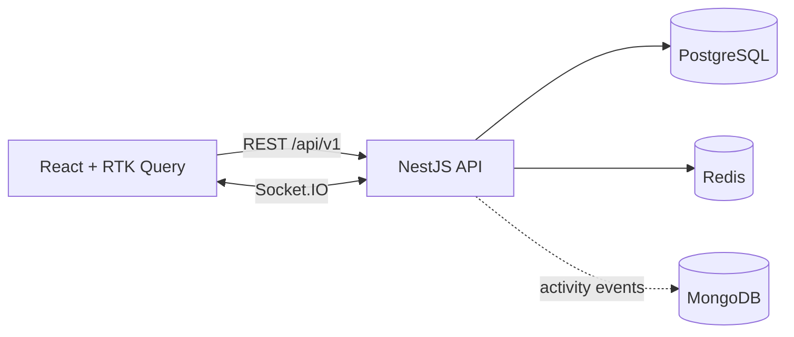

# Squad of Champions

Fullstack solution to the **360 VUZ Fullstack Challenge**. You build a squad of up to 6 fighting-game champions. Characters, filtering and squads are served by a **NestJS API** backed by **PostgreSQL** and **Redis**, and consumed by a **React + Redux Toolkit** frontend.

> 🚧 **Work in progress.** Sections marked _TODO_ get filled in as features land. See [IMPLEMENTATION_PLAN.md](IMPLEMENTATION_PLAN.md) for the roadmap.

---

## Contents

- [Quick start](#quick-start)
- [URLs](#urls)
- [Tech stack](#tech-stack)
- [Repository structure](#repository-structure)
- [Architecture](#architecture)
- [Database schema](#database-schema)
- [Caching strategy](#caching-strategy)
- [API overview](#api-overview)
- [Squad rules and concurrency](#squad-rules-and-concurrency)
- [Bonus features](#bonus-features)
- [Configuration](#configuration)
- [Development mode (Docker)](#development-mode-docker)
- [Local development (without Docker)](#local-development-without-docker)
- [Testing](#testing)
- [Assumptions](#assumptions)
- [Trade-offs](#trade-offs)
- [What I would improve with more time](#what-i-would-improve-with-more-time)

---

## Quick start

Requirements: **Docker** with **Docker Compose**. Node is not needed to run the project.

```bash
cp backend/.env.example backend/.env
docker compose up --build
```

This starts PostgreSQL, Redis and MongoDB, runs the database migrations, seeds the characters from the original JSON file (idempotent), and starts the API and the frontend.

_TODO: the frontend service isn't wired in yet. Today this starts the databases, runs migrations and the seed, and starts the API._

If a host port is already taken, override it, for example `POSTGRES_PORT=5433 docker compose up --build` (also `REDIS_PORT`, `MONGO_PORT`, `API_PORT`).

## URLs

| Service           | URL                                     |
| ----------------- | --------------------------------------- |
| Frontend          | http://localhost:3001 _(TODO: wire up)_ |
| API               | http://localhost:3000/api/v1            |
| Swagger / OpenAPI | http://localhost:3000/api/docs          |
| Health check      | http://localhost:3000/api/v1/health     |

## Tech stack

| Layer                  | Choice                                                                  |
| ---------------------- | ----------------------------------------------------------------------- |
| API                    | NestJS 12, TypeScript 6 (strict), ESM                                   |
| Database               | PostgreSQL 17 with Drizzle ORM and drizzle-kit migrations               |
| Cache                  | Redis 7                                                                 |
| Real-time _(bonus)_    | Socket.IO gateway with the Redis adapter                                |
| Activity log _(bonus)_ | MongoDB 7                                                               |
| Frontend               | React, Redux Toolkit, RTK Query, TypeScript (FSD structure)             |
| Tooling                | Node 24 (`.nvmrc`), ESLint (typescript-eslint strict), Prettier, Vitest |

## Repository structure

```
squad-of-champions/
├─ backend/              # NestJS API
├─ frontend/             # React app (from the frontend challenge)
├─ docker/postgres/init/ # creates the e2e test database on first start
├─ docker-compose.yml    # postgres, redis, mongo, backend, frontend
├─ docker-compose.dev.yml # dev overrides: hot reload, debugger, pretty logs
├─ IMPLEMENTATION_PLAN.md
└─ README.md
```

## Architecture



_TODO: describe the module boundaries (auth, users, characters, squads, cache, health, realtime, activity) and the request flow._

## Database schema

```mermaid
erDiagram
  universes ||--o{ characters : has
  characters ||--o{ character_tags : has
  tags ||--o{ character_tags : labels
  characters ||--|{ character_abilities : has
  users ||--o{ squads : owns

  universes { int id PK; text name UK }
  characters { int id PK "source id"; text name; text quote "nullable"; text image; text thumbnail "nullable"; int universe_id FK }
  tags { int id PK; text name UK }
  character_tags { int character_id PK,FK; int tag_id PK,FK; smallint slot "unique per character" }
  character_abilities { int character_id PK,FK; ability_name ability PK "enum"; smallint score "1-10" }
  users { uuid id PK; text email "unique on lower(email)"; text password_hash }
```

_Squads are added with the squads module._

**Why it looks like this** (from profiling all 208 characters in `characters.json`):

- **The source `id` is the primary key.** Ids are unique integers 1–208, so the seed upserts on them and can run any number of times without duplicates. Squads reference these same ids.
- **`universes` and `tags` are lookup tables.** There are 4 universes and 21 tags, repeated across hundreds of rows. Filters join on small integer keys, and `GET /characters/filters` reads the lists straight from these tables.
- **`character_tags` keeps the tag `slot`** (1–3) so tags come back in the original order. The primary key `(character_id, tag_id)` prevents duplicates, and `(tag_id, character_id)` is indexed for filtering by tag.
- **Abilities are rows, not columns.** Every character has the same 5 abilities scored 1–10, stored as `character_abilities(character_id, ability, score)` with a Postgres enum for the names and a check constraint on the range. Squad stats become a single `AVG(score) ... GROUP BY ability`, and a new ability would need no schema change.
- **Data quirks are kept, not fixed.** RoboCop has no `quote`, Skarlet has no `tags` and Android 21 (Lab Coat) has no `thumbnail`, so those columns allow empty values and Skarlet has zero tag rows. The API falls back to `image` when `thumbnail` is missing. The `grappling` tag (used once, beside 24 uses of `grapple`) is kept exactly as in the source.
- **Indexes:** a trigram GIN index on `lower(name)` for `ILIKE '%term%'` search, `(name, id)` for sorting and keyset pagination by name, and `universe_id`. With 208 rows Postgres correctly prefers a full scan (0.06 ms measured with `EXPLAIN ANALYZE`). With the btree index hidden, it does use the trigram index, so search stays fast as data grows.

**Seeding:** `src/database/seed.ts` validates the JSON's shape with zod, then upserts universes, tags and characters and rebuilds their tag and ability rows in one transaction. Docker mounts `frontend/src/data` read-only at `/data`, so the original file is the single source of truth and cannot be modified. The entrypoint runs migrate, then seed, on every start.

## Caching strategy

Character reads are cached in Redis. Squads are per-user and change often, so they are not cached.

| What          | Key                                          |
| ------------- | -------------------------------------------- |
| A list page   | `cache:characters:v{version}:list:{hash}`    |
| One character | `cache:characters:v{version}:character:{id}` |
| Filter values | `cache:characters:v{version}:filters`        |

- **Identical requests share a key.** The hash covers the filters, sort, order, page size and cursor position after normalizing them: values are trimmed, de-duplicated and sorted, and defaults are filled in. So `tags=ninja,human` and `tags=human, ninja` hit the same entry.
- **Invalidation is a version bump.** Every key embeds `cache:characters:version`, and the seed runs `INCR` on it after writing, so old entries stop being read immediately and expire through their TTL (`CACHE_TTL_SECONDS`, default 1 hour). This avoids scanning or deleting keys.
- **Concurrent misses load once.** If several requests miss the same key at the same moment, one database load serves them all.
- **Redis outages degrade, they don't fail.** If Redis is unreachable, requests read straight from Postgres.
- **Every characters response says what happened** in an `X-Cache` header: `HIT`, `MISS`, or `BYPASS` when Redis is down.

**Measured** (dev mode, 50 items, median of 11 requests): 6.7 ms on a miss, 2.4 ms on a hit. With statement logging enabled, an uncached list page ran exactly **4 SQL queries whatever its size** (page, total, tags, abilities), a single character 3 and the filter values 2, so there are no N+1 queries.

## API overview

Full interactive docs are in Swagger at `/api/docs`. Every endpoint uses the `/api/v1` prefix.

| Method               | Endpoint                              | Auth |
| -------------------- | ------------------------------------- | ---- |
| POST                 | `/auth/register`                      | —    |
| POST                 | `/auth/login`                         | —    |
| GET                  | `/auth/me`                            | JWT  |
| GET                  | `/characters`                         | —    |
| GET                  | `/characters/filters`                 | —    |
| GET                  | `/characters/:id`                     | —    |
| GET / POST           | `/squads`                             | JWT  |
| GET / PATCH / DELETE | `/squads/:id`                         | JWT  |
| POST / DELETE        | `/squads/:id/characters/:characterId` | JWT  |
| GET                  | `/health`                             | —    |

### Characters

`GET /characters` query parameters (all optional):

| Param           | Meaning                                                                                 |
| --------------- | --------------------------------------------------------------------------------------- |
| `search`        | Case-insensitive substring of the name. `%`, `_` and `\` match literally                |
| `tags`          | Tag names, comma-separated (`tags=alien,strong`) or repeated (`tags=alien&tags=strong`) |
| `tagMatch`      | `any` (default): a character has at least one of the tags. `all`: it has every one      |
| `universe`      | Universe names, comma-separated or repeated                                             |
| `sort`, `order` | `name` (default) or `id`; `asc` (default) or `desc`                                     |
| `limit`         | 1–50, default 20                                                                        |
| `cursor`        | The `nextCursor` from the previous page                                                 |

Different filters combine with AND. The response is `{ items, nextCursor, total }`, where `nextCursor` is `null` on the last page.

**Why cursor pagination:** the frontend loads more results as you scroll. A keyset cursor on `(name, id)` never skips or repeats a character when pages are fetched one after another, and it stays fast however deep you go, unlike `OFFSET`. The cursor is opaque and records its sort, so reusing it with a different sort returns `INVALID_CURSOR`. The trade-off is that you can't jump to page N; `total` lets the UI still show "44 results".

Each character is returned as `{ id, name, quote, image, thumbnail, universe, tags, abilities }`. `tags` is a list of names in their original slot order, and `abilities` is `[{ name, score }]` in a fixed order (Mobility, Technique, Survivability, Power, Energy).

`GET /characters/filters` returns `{ universes, tags, abilities, sortFields }`; universes and tags come as `{ name, count }`, so the frontend builds its filter UI from the data instead of hard-coding it.

Error response format:

```json
{
  "statusCode": 422,
  "error": "SQUAD_FULL",
  "message": "A squad cannot have more than 6 characters"
}
```

| Code                         | Status | When                                                                                  |
| ---------------------------- | ------ | ------------------------------------------------------------------------------------- |
| `VALIDATION_FAILED`          | 400    | Invalid or unknown fields; `details` lists each field's errors                        |
| `UNAUTHORIZED`               | 401    | Missing, malformed, forged or expired token, or the user no longer exists             |
| `INVALID_CREDENTIALS`        | 401    | Wrong email or password (same response for both, so emails can't be probed)           |
| `EMAIL_TAKEN`                | 409    | Registering an email that exists, case-insensitively                                  |
| `NOT_FOUND`                  | 404    | Unknown route                                                                         |
| `INVALID_CURSOR`             | 400    | Malformed cursor, or a cursor reused with a different sort or order                   |
| `INVALID_ID`                 | 400    | `GET /characters/:id` with a non-numeric id                                           |
| `CHARACTER_NOT_FOUND`        | 404    | No character with that id                                                             |
| `SQUAD_NOT_FOUND`            | 404    | No squad with that id for the current user                                            |
| `SQUAD_FULL`                 | 422    | More than 6 characters                                                                |
| `CHARACTER_ALREADY_IN_SQUAD` | 409    | A character twice in the same squad                                                   |
| `CHARACTER_NOT_IN_SQUAD`     | 404    | Removing a character that isn't in the squad                                          |
| `UNKNOWN_CHARACTERS`         | 422    | Character ids in a create/replace that don't exist; `details.characterIds` lists them |
| `SQUAD_NAME_TAKEN`           | 409    | The user already has a squad with that name, ignoring case                            |
| `SQUAD_LIMIT_REACHED`        | 422    | The user already has 20 squads                                                        |
| `SERVICE_UNAVAILABLE`        | 503    | `/health` when Postgres or Redis is down; `details` has the per-dependency report     |

### Authentication

- `POST /auth/register` and `POST /auth/login` return `{ accessToken, tokenType: "Bearer", expiresIn, user }`. Registering logs the user in straight away.
- Send `Authorization: Bearer <accessToken>` on protected routes. Every route requires a token unless it is marked public (auth, characters, health).
- Passwords are hashed with **argon2id** (`@node-rs/argon2`, prebuilt binaries with no install scripts). Emails are trimmed and lowercased, and a unique index on `lower(email)` enforces uniqueness in the database, so two concurrent registrations can't both succeed.
- Login runs the hash check even when the email doesn't exist, so response times don't reveal which emails are registered.
- Tokens are HS256 JWTs, valid for `JWT_EXPIRES_IN_SECONDS`. There are no refresh tokens (out of scope).

## Squad rules and concurrency

Every rule is enforced on the server, whatever the client sends:

| Rule                                           | Error                                                                                                               |
| ---------------------------------------------- | ------------------------------------------------------------------------------------------------------------------- |
| At most **6** characters per squad             | `422 SQUAD_FULL`                                                                                                    |
| A character appears at most once per squad     | `409 CHARACTER_ALREADY_IN_SQUAD`                                                                                    |
| Every character id must exist                  | `422 UNKNOWN_CHARACTERS` (create/replace, with the missing ids in `details`) or `404 CHARACTER_NOT_FOUND` (add one) |
| Squad names are unique per user, ignoring case | `409 SQUAD_NAME_TAKEN`                                                                                              |
| At most 20 squads per user                     | `422 SQUAD_LIMIT_REACHED`                                                                                           |
| Users only see and change their own squads     | `404 SQUAD_NOT_FOUND` (same as a missing squad, so ids can't be probed)                                             |

The rules live in pure functions (`modules/squads/domain/squad.rules.ts`) with unit tests, and squad stats are computed by `domain/squad.stats.ts`: average, min and max per ability plus an overall average, rounded to 2 decimals, with `null` for an empty squad.

**Concurrency: two layers.**

1. **Row locks in the app.** Every member change runs in one transaction that first locks the squad row (`SELECT … FOR UPDATE`), then reads the members, checks the rules and writes. Two requests for the same squad therefore run one after the other, and the second one sees the first one's result. Creating and renaming squads lock the user's row the same way, so the name check and the 20-squad limit can't race either.
2. **Constraints in the database.** `squad_members` has a check that `position` is between 1 and 6, a unique `(squad_id, position)` and a primary key `(squad_id, character_id)`. Even if the app logic had a bug, Postgres could not store a 7th member or a duplicate. These are a safety net: if one ever fired it would surface as a 500, because it would mean a bug.

New members take the first free slot (1–6), so removing a character leaves a gap that the next add fills. `PATCH` with `characterIds` replaces all members in the given order.

**Tested against real Postgres:** 10 parallel adds to a squad with 5 members give exactly one `201` and nine `SQUAD_FULL`. 10 parallel adds to an empty squad give exactly 6 members in slots 1–6. 5 parallel adds of the same character give one `201` and four `409`s. Two parallel creates with the same name give one `201` and one `409`.

## Bonus features

- [ ] WebSockets: squad sync across tabs and devices, live popularity, Redis adapter
- [ ] MongoDB: squad activity log with history and pick-statistics endpoints

_TODO: explain why the activity log fits a document store._

## Configuration

All settings come from environment variables. See [`backend/.env.example`](backend/.env.example) for the full list with comments. The repository contains no secrets.

## Development mode (Docker)

`docker-compose.dev.yml` runs the backend with hot reload instead of the production image:

- Source is mounted from `./backend`, and `nest start --watch` reloads about 2 seconds after you save.
- `NODE_ENV=development`, so logs are pretty-printed.
- Migrations run on every start.
- The Node debugger listens on `localhost:9229` (override with `DEBUG_PORT`). Attach from VS Code or Chrome DevTools.
- The dev image is tagged `squad-of-champions-backend:dev`, so it never replaces the production image.

```bash
docker compose -f docker-compose.yml -f docker-compose.dev.yml up --build
```

To make dev mode the default on your machine, create a root `.env` (gitignored) with:

```bash
COMPOSE_FILE=docker-compose.yml:docker-compose.dev.yml
```

Plain `docker compose up` then starts dev mode, while a fresh clone still gets production. Inside the container, `node_modules` is kept separate from your host's (Linux vs macOS binaries). After changing dependencies, rebuild and reset it:

```bash
docker compose up --build --renew-anon-volumes
```

## Local development (without Docker)

```bash
nvm use                       # Node 24.21.0
docker compose up -d --wait postgres redis mongo
cd backend
cp .env.example .env          # then switch the hosts to localhost
npm install
npm run start:dev             # pretty logs in development, JSON in production
```

Database scripts: `npm run db:generate` (drizzle-kit migration from the schema), `npm run db:migrate` and `npm run db:seed` (the Docker entrypoint runs both on every start), and `npm run db:studio`.

_TODO: add the migrate and seed commands, and the frontend steps._

## Testing

```bash
cd backend
npm run lint          # ESLint
npm run format:check  # Prettier
npm run typecheck     # tsc --noEmit
npm test              # unit tests (no infrastructure needed)

# e2e tests run against the compose databases, using a separate Postgres
# database (squad_of_champions_test) and Redis DB index 1, from backend/.env.test
docker compose up -d --wait postgres redis
npm run test:e2e
```

The test database is created automatically the first time the Postgres volume starts (`docker/postgres/init/`). If your volume predates that script, create it once:

```bash
docker compose exec postgres psql -U squad -d squad_of_champions -c "CREATE DATABASE squad_of_champions_test OWNER squad"
```

## Assumptions

Where the brief was ambiguous, I made a reasonable choice and recorded it here:

- A user can own **many squads**. The frontend has a squad switcher.
- Several tags match **any** of them by default (`tagMatch=all` requires every one). Different filters combine with AND.
- Filter values that don't exist return an empty page rather than an error.
- Characters can be sorted by `name` or `id`. Sorting by ability score is left out, because nothing in the brief asks for it.
- The `grappling` tag is kept exactly as in the source, even though it looks like a variant of `grapple`.
- Squad names are 1–50 characters after trimming and unique per user, ignoring case. A user can have up to 20 squads.
- `GET /squads` returns summaries (`id`, `name`, `memberCount`, timestamps), and `GET /squads/:id` the full squad with characters and stats. Every member change returns the updated squad, so the frontend never needs a second request.
- Stats for an empty squad are `null` rather than 0, so "no data" can't be mistaken for "scores of zero".

## Trade-offs

_TODO_

## What I would improve with more time

_TODO_
